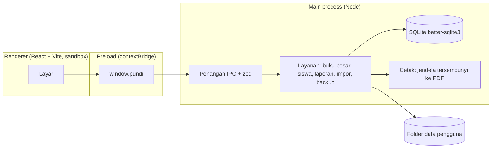

# ARCHITECTURE — Pundi

Status: Draf 0.1 — 30 September 2026. Memenuhi [PRD](PRD.md); data mengikuti [ERD](ERD.md). Setiap pilihan diberi status bukti: **Terbukti** (sudah dijalankan pemilik pada proyek lain), **Diasumsikan** (belum diuji di proyek ini), **Spike** (harus dibuktikan dulu, lihat §9).

## 1. Ringkasan

Aplikasi desktop Electron, satu proses utama memegang basis data dan cetak; antarmuka React di jendela renderer yang terisolasi. **Tidak ada server HTTP lokal** dan tidak ada jaringan.



## 2. Pilihan teknologi

| Area | Pilihan | Status | Alasan |
| --- | --- | --- | --- |
| Cangkang | Electron (versi yang punya prebuilt `better-sqlite3` untuk Windows x64 dan macOS arm64) | Terbukti untuk Windows di `penilaian-pib` (Electron 42.11.9); macOS arm64 **Spike S-01** | Pola sama dengan PIB dan Lembaran |
| Bahasa | TypeScript `strict` | Diasumsikan | Uang dan saldo butuh tipe yang ketat |
| UI | React + Vite | Diasumsikan | Konsisten dengan rencana Lembaran |
| Basis data | SQLite lewat `better-sqlite3` (sinkron, di main) | Terbukti di PIB (Windows) | Satu berkas, transaksi ACID |
| Validasi | `zod` di setiap batas IPC dan impor | Diasumsikan | |
| Excel | `exceljs` (baca/tulis `.xlsx`) | Terbukti di PIB | |
| PDF | `webContents.printToPDF` pada jendela tersembunyi tanpa JS | Spike S-03 | Satu jalur untuk preview dan berkas |
| Uji | Vitest (unit), Playwright + Electron (alur) | Diasumsikan | |
| Paket | `electron-builder` NSIS (Windows), DMG/pkg (macOS) | Terbukti NSIS di PIB; macOS **Spike S-01** | |

**Mengapa bukan Laravel/PHP dibungkus**: biaya membawa runtime PHP, scheduler, dan `storage:link`, serta proses latar belakang, lebih besar daripada manfaatnya untuk aplikasi satu pengguna.

## 3. Model proses dan keamanan (NFR-01, NFR-07)

- Jendela utama: `contextIsolation: true`, `nodeIntegration: false`, `sandbox: true`. Jendela cetak tersembunyi: `javascript: false`, tanpa preload.
- **Tidak memakai `http://127.0.0.1`.** Halaman dimuat lewat protokol khusus aplikasi (`pundi-app://`) atau `file://` dari paket. Ini menghapus seluruh kelas masalah pencocokan origin yang ditemukan pada PIB (`startsWith(origin)`); bila suatu saat perlu membandingkan URL, pakai `new URL(url).origin === origin`, bukan awalan teks.
- Sesi memblokir semua permintaan keluar; navigasi dan jendela baru ditolak; semua permintaan izin ditolak.
- Renderer **tidak pernah** mengirim jalur berkas. Dialog buka/simpan dibuka oleh main, hasilnya berupa token sementara.
- Setiap penangan IPC memverifikasi pengirim (`event.senderFrame`) dan memvalidasi argumen dengan `zod`.
- Nilai dari Excel/CSV adalah masukan tidak tepercaya: divalidasi, dan semua teks yang masuk HTML cetak wajib lewat `esc()`.
- Log hanya berisi jumlah, kode galat, dan durasi. Tidak pernah nama, nomor, atau nominal.

## 4. Lapisan dan modul

```
src/
  main/         index.ts, window.ts, ipc/, services/, db/, print/
  preload/      index.ts   (window.pundi)
  renderer/     app/, screens/, components/, styles/
  shared/       types.ts, schemas.ts, rupiah.ts, errors.ts
migrations/     0001_awal.sql ...
```

| Layanan | Tanggung jawab | CAP |
| --- | --- | --- |
| `ledger` | Satu-satunya jalur menulis `transaksi`; menghitung saldo, memberi nomor bukti, menolak penarikan berlebih, membuat pembalik | 05–08, 17 |
| `siswa` | CRUD siswa, penempatan kelas, status | 03, 12 |
| `akademik` | Tahun ajaran dan kelas | 02 |
| `impor` | Baca Excel/CSV, validasi, pratinjau, impor atomik | 04, 14 |
| `laporan` | Kueri agregat, keluaran untuk layar/PDF/Excel | 10, 11 |
| `cetak` | Render HTML struk dan laporan ke PDF | 09, 10, 11 |
| `backup` | Backup manual/otomatis, restore, retensi | 13 |
| `integritas` | Pemeriksaan saldo | 17 |
| `pengaturan` | Profil sekolah, tema, PIN | 01, 15, 16 |

Aturan: **hanya `ledger` yang boleh menjalankan `INSERT` ke `transaksi`**. Layanan lain memanggilnya. Tidak ada kode lain yang menyentuh kolom `saldo_setelah`.

## 5. Kontrak IPC (ringkas)

Semua nama diawali domain, argumen dan hasil didefinisikan sebagai skema `zod` di `shared/schemas.ts`. Hasil selalu `{ ok: true, data } | { ok: false, kode, pesan }`; `kode` tidak memuat data siswa.

| Saluran | Fungsi |
| --- | --- |
| `siswa.cari`, `siswa.simpan`, `siswa.detail` | CAP-03 |
| `transaksi.setor`, `transaksi.tarik`, `transaksi.balik`, `transaksi.riwayat` | CAP-05–07, 10 |
| `impor.pratinjau`, `impor.terapkan` | CAP-04, 14 |
| `laporan.harian`, `laporan.kelas`, `laporan.siswa`, `laporan.rekap`, `laporan.ekspor` | CAP-11 |
| `cetak.struk`, `cetak.pdf` | CAP-09 |
| `backup.buat`, `backup.restore`, `backup.daftar` | CAP-13 |
| `integritas.periksa` | CAP-17 |
| `pengaturan.baca`, `pengaturan.simpan` | CAP-01, 15, 16 |

## 6. Buku besar (inti)

Alur `transaksi.tarik(siswaId, jumlah, tanggal, keterangan?)` dalam **satu transaksi SQL**:

1. Baca saldo terakhir siswa.
2. Tolak bila `jumlah <= 0`, bukan bilangan bulat, atau `jumlah > saldo`.
3. Ambil nomor bukti berikutnya dari penghitung.
4. Sisipkan baris dengan `nilai = -jumlah`, `saldo_setelah = saldo - jumlah`, `kelas_id` = kelas siswa saat ini.
5. Catat `audit_log` (tanpa nominal). Selesai.

Nominal dipakai sebagai `number` bilangan bulat aman (< 2^53). Format tampilan `Rp 1.250.000` ada di `shared/rupiah.ts`; tidak ada aritmetika desimal.

## 7. Data di komputer pengguna

```
{userData}/Pundi/
  pundi.sqlite (+ -wal, -shm)
  aset/logo.png
  backups/auto/, backups/manual/
  logs/
```
Folder data dipisah dari folder program. Uninstall tidak menghapus data kecuali pengguna memilih. Backup otomatis: harian saat aplikasi dibuka dan sebelum migrasi; 7 terakhir disimpan. Restore membuat cadangan `pre-restore` lebih dulu.

## 8. Build, rilis, dan lintas platform

| Hal | Windows (0.1) | macOS Apple Silicon (setelah 0.1) |
| --- | --- | --- |
| Build | di Windows atau CI `windows-latest` | **di macOS** (Mac pemilik atau CI `macos-14`); modul native `better-sqlite3` untuk arm64 |
| Paket | NSIS | DMG atau pkg satu klik |
| Penandatanganan | Tidak ditandatangani (SmartScreen akan memperingatkan); sertifikat ditunda | **Wajib** tanda tangan Developer ID dan **notarisasi** agar Gatekeeper tidak memblokir |
| Data | `%APPDATA%` | `~/Library/Application Support` |

Kode aplikasi sama untuk keduanya; yang berbeda hanya build dan penandatanganan. Jalur file memakai `path` dan `app.getPath`, tidak ada jalur Windows yang ditulis mati. Nama installer diambil dari `version` di `package.json`; tag rilis harus sama (`v0.1.0` untuk `0.1.0`).

## 9. Spike (harus dibuktikan sebelum bergantung)

| ID | Pertanyaan | Bukti selesai |
| --- | --- | --- |
| S-01 | Electron + `better-sqlite3` terpasang dan berjalan di **Windows x64 dan macOS arm64** dari satu basis kode | Build kedua platform, aplikasi kosong membuka dan menulis satu baris SQLite |
| S-02 | Cetak struk ke printer termal 58/80 mm dari jendela cetak | Cetak nyata pada printer yang dipakai pengguna, ukuran diukur |
| S-03 | `printToPDF` menghasilkan laporan multi-halaman tanpa terpotong dan dengan font dibundel | PDF contoh 200 baris, diperiksa manual |
| S-04 | Impor Excel hasil ekspor aplikasi lama (format kolomnya) dibaca benar | Berkas ekspor contoh **sintetis** dari aplikasi lama diimpor tanpa selisih |
| S-05 | Trigger anti-ubah dan `VACUUM INTO` berperilaku benar di WAL | Uji otomatis: UPDATE/DELETE ditolak, backup dapat dibuka dan cocok |

## 10. Pengujian

- **Unit (Vitest)** pada `ledger` dengan uji berbasis properti: urutan acak setoran/penarikan/pembalik selalu menjaga `saldo >= 0`, `SUM(nilai) = saldo`, dan CAP-17 tanpa selisih.
- Uji basis data memakai berkas sementara, **tidak pernah** basis data pengguna.
- Uji alur (Playwright): tambah siswa, setor, tarik, koreksi, laporan, backup, restore.
- Data uji hanya **sintetis**.

## 11. Keputusan arsitektur

| ID | Keputusan | Alasan |
| --- | --- | --- |
| A-01 | Buku besar tambah-saja dengan pembalik | Jejak audit, tidak ada penyuntingan diam-diam |
| A-02 | Uang bilangan bulat | Tidak ada galat pembulatan |
| A-03 | Tanpa server HTTP lokal | Menghapus permukaan serangan dan galat origin |
| A-04 | Migrasi dari aplikasi lama lewat **Excel**, bukan membaca `.mdb` | Tidak perlu driver Access; jalan di macOS; tidak menyentuh berkas aslinya |
| A-05 | Satu operator tanpa akun | Sesuai PRD; D-08 bisa mengubah |
| A-06 | Cetak lewat jendela tersembunyi | Satu jalur untuk preview dan PDF |

## 12. Risiko teknis

- Modul native pada macOS arm64 dan versi Electron yang tidak punya prebuilt (S-01).
- Perilaku driver printer termal berbeda antar merek (S-02).
- Antivirus Windows menandai installer tidak bertanda tangan; sertakan panduan.
