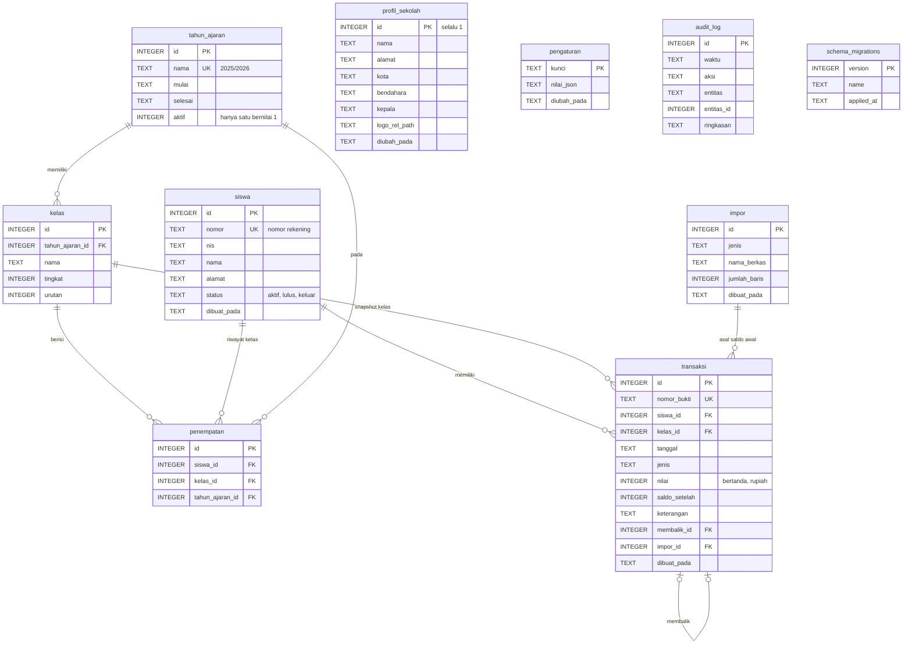

# ERD — Pundi

Status: Draf 0.1 — 30 September 2026. Memenuhi [PRD](PRD.md). Basis data: **SQLite** satu berkas (`pundi.sqlite`), diakses hanya dari proses utama ([ARCHITECTURE](ARCHITECTURE.md)).

## 1. Prinsip

- **Buku besar tambah-saja.** Transaksi tidak pernah diubah atau dihapus; koreksi berupa transaksi pembalik. Ditegakkan dengan pemicu (trigger) di basis data, bukan hanya di kode.
- **Uang = bilangan bulat rupiah** (`INTEGER`). Tidak ada `REAL`/`float` untuk nominal.
- **Saldo diturunkan.** Kebenaran saldo = penjumlahan `nilai` transaksi per siswa. Kolom `saldo_setelah` adalah salinan untuk verifikasi dan cetak, dan diperiksa oleh CAP-17.
- **Tahun ajaran dan kelas** dimodelkan, sehingga kenaikan kelas tidak menghapus riwayat.
- Migrasi hanya maju, berkas SQL bernomor, cadangkan basis data sebelum migrasi.

## 2. Diagram

## 3. Kamus tabel

Waktu disimpan sebagai teks ISO 8601 UTC; `tanggal` transaksi sebagai `YYYY-MM-DD` (tanggal kejadian menurut pengguna, zona waktu lokal).

### 3.1 `tahun_ajaran` (CAP-02)
`aktif` bernilai 0 atau 1; indeks unik parsial memastikan paling banyak satu baris `aktif = 1`.

### 3.2 `kelas` (CAP-02)
UNIQUE (`tahun_ajaran_id`, `nama`). `tingkat` (mis. 7, 8, 9) dipakai untuk saran kenaikan kelas.

### 3.3 `siswa` (CAP-03)
| Kolom | Catatan |
| --- | --- |
| `nomor` | **UNIQUE**, dibuat otomatis berurutan (mis. `T-000123`), tidak pernah dipakai ulang |
| `nis` | nullable; UNIQUE bila diisi |
| `nama` | wajib |
| `status` | `CHECK IN ('aktif','lulus','keluar')` |

Siswa **tidak dihapus** bila punya transaksi (kunci asing `RESTRICT` dari `transaksi`). Yang tidak punya transaksi boleh dihapus.

### 3.4 `penempatan` (CAP-02, CAP-12)
Riwayat kelas per tahun ajaran. UNIQUE (`siswa_id`, `tahun_ajaran_id`). Kelas "saat ini" = penempatan pada tahun ajaran aktif.

### 3.5 `transaksi` (CAP-05 sampai CAP-09)
Buku besar tambah-saja.

| Kolom | Catatan |
| --- | --- |
| `nomor_bukti` | **UNIQUE**, berurutan (mis. `TRX-2026-000045`), dibuat dalam transaksi SQL yang sama; tanpa celah |
| `siswa_id` | FK `siswa(id)` `ON DELETE RESTRICT` |
| `kelas_id` | snapshot kelas siswa saat transaksi dicatat (untuk laporan per kelas); FK `ON DELETE RESTRICT` |
| `jenis` | `CHECK IN ('setoran','penarikan','biaya_adm','pembalik','saldo_awal')` |
| `nilai` | bilangan bulat **bertanda**: positif menambah saldo (`setoran`, `saldo_awal`), negatif mengurangi (`penarikan`, `biaya_adm`); `pembalik` mengambil tanda kebalikan dari transaksi yang dibalik. `CHECK (nilai <> 0)` |
| `saldo_setelah` | saldo siswa sesudah transaksi ini; `CHECK (saldo_setelah >= 0)` |
| `membalik_id` | wajib untuk `pembalik`, kosong untuk jenis lain; FK ke `transaksi(id)`; UNIQUE agar satu transaksi hanya dibalik sekali |
| `keterangan` | wajib (alasan) untuk `pembalik` |
| `impor_id` | terisi untuk `saldo_awal` hasil impor |

Indeks: (`siswa_id`, `id`), (`tanggal`), (`kelas_id`, `tanggal`).

### 3.6 `impor` (CAP-04, CAP-14)
Catatan setiap impor (jenis `siswa` atau `saldo_awal`, nama berkas tanpa jalur, jumlah baris). Tidak menyimpan isi baris.

### 3.7 `profil_sekolah`, `pengaturan` (CAP-01, CAP-15)
`profil_sekolah` satu baris (`CHECK (id = 1)`). `pengaturan` pasangan kunci-nilai:

| Kunci | Nilai | Bawaan |
| --- | --- | --- |
| `tema` | `"putih"` \| `"hijau"` \| `"biru"` \| `"ungu"` \| `"grafit"` | `"putih"` |
| `folder_backup` | jalur | Dokumen/`Pundi` |
| `backup_otomatis` | boolean | `true` |
| `ukuran_struk` | `"58"` \| `"80"` \| `"a6"` | `"80"` (D-10) |
| `pin_hash` | hash | kosong |

### 3.8 `audit_log`
Aksi penting (`siswa.tambah`, `transaksi.tambah`, `transaksi.balik`, `backup.buat`, `restore`, `impor`). `ringkasan` **tidak memuat nama siswa atau nominal**, hanya kode dan ID (NFR-02).

## 4. Aturan integritas

1. `PRAGMA foreign_keys = ON`, `journal_mode = WAL`, `synchronous = FULL`.
2. **Pemicu** menolak `UPDATE` dan `DELETE` pada `transaksi` (`RAISE(ABORT, 'transaksi_tidak_boleh_diubah')`).
3. Pencatatan transaksi terjadi dalam **satu transaksi SQL**: baca saldo → hitung → sisip → perbarui penghitung nomor bukti. Bila gagal, tidak ada yang tersimpan.
4. **Penarikan** ditolak bila `saldo_setelah < 0` (CHECK sebagai jaring pengaman terakhir; kode memeriksa lebih dulu untuk pesan yang jelas).
5. **Pembalik** hanya untuk transaksi yang belum dibalik dan bukan `pembalik` itu sendiri. Bila saldo menjadi negatif akibat pembalikan, ditolak dengan pesan yang menjelaskan.
6. Nomor bukti dan nomor siswa dibuat dari tabel penghitung dalam transaksi SQL yang sama (bukan dari `MAX()+1` di luar transaksi).
7. **CAP-17 (Periksa saldo)**: untuk setiap siswa, `SUM(nilai) = saldo_setelah` pada transaksi terakhir; dan setiap `saldo_setelah` = saldo sebelumnya + `nilai`. Selisih dilaporkan, tidak diperbaiki otomatis.
8. Backup: salin berkas dengan `VACUUM INTO` atau API backup SQLite pada koneksi yang aman terhadap WAL, bukan salinan berkas mentah saat aplikasi berjalan. Simpan 7 cadangan otomatis terakhir.
9. Sebelum migrasi skema, buat cadangan otomatis. Jangan mengedit migrasi yang sudah dirilis.
10. Batas: 5.000 siswa dan 200.000 transaksi masih nyaman (NFR-04).

## 5. Kueri utama

| Kebutuhan | Kueri |
| --- | --- |
| Saldo siswa | `saldo_setelah` transaksi terakhir; diverifikasi dengan `SUM(nilai)` |
| Buku besar siswa | `transaksi WHERE siswa_id = ? ORDER BY id` |
| Laporan harian | `transaksi WHERE tanggal = ?` digabung `siswa` |
| Rekap per kelas | `transaksi` dikelompokkan `kelas_id`, jumlah setoran, penarikan, saldo |
| Rekap saldo | saldo terakhir per siswa aktif, dijumlahkan per kelas |

## 6. Ditunda (tidak ada di skema 0.1)

Bergantung keputusan pemilik ([PRD](PRD.md) D-02 sampai D-05): `peminjam`, `pinjaman`, `angsuran`, `setoran_bank`, dan jenis transaksi `bunga`. Skema 0.1 tidak boleh menambahkannya sebelum keputusan diambil.

## 7. Sengaja tidak ada

- Tabel pengguna, peran, sesi (satu operator; D-08 bisa mengubahnya).
- Kolom saldo yang bisa diubah langsung di tabel `siswa`.
- Tabel template atau pemetaan global.
